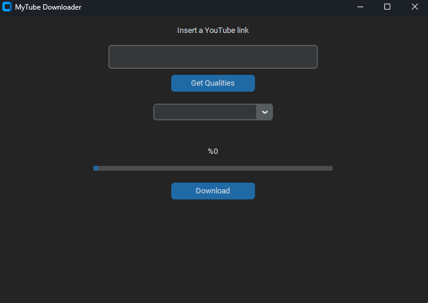

# mytubedownloader


mytubedownloader is a simple youtube video downloader. It downloads video with the quality you selected and merges with audio -using FFmpeg- in a mp4 file.

---

## Features
- Simple GUI
- Choose From Different Quality Options
- Progress Percentage + Progress Bar

---

## How to Use
1. Paste video link
2. Click **Fetch Qualities**
3. Select the quality
4. Click **Download**

---

## Requirements
- Python 3
- `tkinter` (usually included with Python on Windows)
- `customtkinter`
- `pytubefix`
- FFmpeg (installed and available in PATH)

---

## Installation for Windows
```bash
pip install pytubefix
pip install customtkinter
pip install certifi
```
---

### FFmpeg (Windows)

1) Download an FFmpeg Windows build (from the official FFmpeg download page).
2) Extract the `.zip` file (example folder: `C:\ffmpeg\`).
3) Add the `bin` folder to your **PATH** (example: `C:\ffmpeg\bin`).
4) Verify it works in CMD/PowerShell.

---

## Installation for MacOS
```bash
# 1) Clone the repository
git clone https://github.com/OmerMert24/mytubedownloader.git
cd mytubedownloader

# 2) Create and activate a virtual environment
python3 -m venv .venv
source .venv/bin/activate

# 3) Install Python dependencies
pip install pytubefix customtkinter certifi

# 4) Install FFmpeg (via Homebrew)
brew --version || /bin/bash -c "$(curl -fsSL https://raw.githubusercontent.com/Homebrew/install/HEAD/install.sh)"
brew install ffmpeg

# 5) Run the app
python3 main.py
```

## SSL Certificate Error (MacOS)
If you see Certificate error, run:
```
export SSL_CERT_FILE="$(python3 -c 'import certifi; print(certifi.where())')"
```
Then run the app again.

---

## FFmpeg check
```bash
ffmpeg -version
```
---

## Run
```bash
python main.py # Windows
python3 main.py # MacOS
```

---

## Notes
- Temporary files are deleted after merging.
